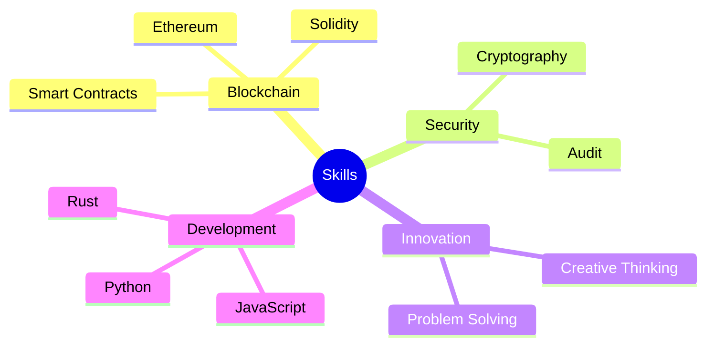

# Ador Ahmed (ChefAdorous) 👨‍🍳✨


## About Me 🚀
Creating secure and innovative blockchain solutions. Let's cook up some amazing code! 🍳💻

## Skills Mindmap 🧠


## Tech Stack 🛠️


## GitHub Activity 📊
- 🎉 New to GitHub! Just joined and excited to start contributing.
- 🌱 Currently learning and exploring new technologies.
- 💡 Open to collaborations and innovative projects.

## Let's Connect! 🤝
- 📧 Email: chefadorous@gmail.com
- 🌐 Website: https://chefadorous.me
- 📱 Telegram: https://t.me/ChefAdorous

## Support My Work 💖
If you find my projects helpful, consider supporting me:
- ETH/BSC/Polygon: `0xb549579A6d5Ccfa3f8B143D11BCb4BF1494f7880`

## Watch My Contributions Grow! 🌱➡🌳
```
         🌱
       🌿🌿🌿
     🌳🌳🌳🌳🌳
   🌴🌴🌴🌴🌴🌴🌴
      [▓▓▓▓▓▓]
      [▓▓▓▓▓▓]
```

## Fun Fact 🎭
Did you know? The word 'blockchain' is like a digital recipe book - it keeps track of all the ingredients (transactions) that go into making the perfect dish (secure network)! 👨‍🍳📚

---

<p align="center">
  
</p>

<p align="center">
  <i>Always cooking up new ideas! 💡🍳</i>
</p>
